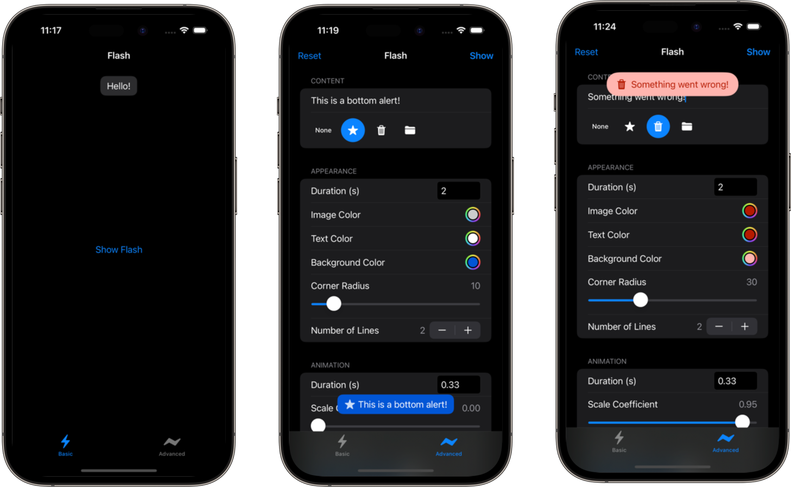

-----

[](https://github.com/conmulligan/Flash.swift/actions/workflows/swift.yml)

Flash messages -- or toasts, in Android parlance -- are discrete, non-modal alerts designed to notify users without completely capturing their focus. For example, you might use a flash message to let the user know that new data has finished loading, that a piece of data has been saved, or that a non-critical error has occurred.

Flash.swift makes displaying these kinds of messages easy, and gives you flexibility to custom their appearance and behaviour.

## Screenshots



## Installation

Flash.swift is available through the [Swift Package Manager](https://swift.org/package-manager/). To use Flash.swift with SPM, add `https://github.com/conmulligan/Flash.swift.git` as a dependency.

## Getting Started

For an interactive example that you can build and run, check out the Xcode project in the `Example` directory.

### Basic example

Showing a flash message can be as simple as creating a `FlashView` instance and calling the `show()` function:

```swift
let flash = FlashView(text: "Hello!")
flash.show()
```

You can also pass an image:

```swift
let star = UIImage(systemName: "star.fill")
let flash = FlashView(text: "Hello!", image: star)
flash.show()
```

By default, flash views are added directly to the active window's view heirarchy. Adding the flash view direct to the window has some advantages; for example, doing so allows the flash view to survive changes to the view heirarchy, like a view controller being popped from a navigation stack.

If you want to show a flash message in a specific view, pass a `UIView` instance to the `show()` method:

```swift
flash.show(in: view)
```

By default, flash messages are visible for 2 seconds. You can change the duration by passing a `TimeInterval` value:

```swift
flash.show(duration: 5) // seconds
```

If you want the flash message to appear indefinitely, pass a duration of `0`:

```swift
flash.show(duration: 0)
```

The flash message will be visible until the user taps on it (if tap-to-dismiss is enabled), or until dismissed programatically:

```swift
flash.hide()
```

### Customization

The `FlashView.Configuration` struct allows you to customize the flash view's alignment, background color, text color and more. In most cases, the default configuration should be used as a baseline:

```swift
var configuration = FlashView.Configuration.defaultConfiguration()
configuration.titleProperties.textColor = .red
```

You can also create a configuration from scratch using the default initializer:

```swift
let configuration = FlashView.Configuration(alignment: .bottom,
                                            playsHaptics: false,
                                            tapToDismiss: false)
```

Once you have created a configuration, pass it to the flash view's initializer:

```swift
let flash = FlashView(text: "Hello!", configuration: configuration)
flash.show()
```

If you want to change the configuration for all flash views, use the `shared` static property:

```swift
FlashView.Configuration.shared.titleProperties.textColor = .white
FlashView.Configuration.shared.backgroundProperties.color = .systemBlue
```

#### Configuration Properties

| Property               | Description                                                                                                       |
|------------------------|-------------------------------------------------------------------------------------------------------------------|
| `alignment`            | The flash view's vertical alignment.                                                                              |
| `spacing`              | The image-text spacing.                                                                                           |
| `insets`               | The flash view's layout insets, relative to its parent view.                                                      |
| `contentInsets`        | The flash view's inner content insets.                                                                            |
| `backgroundProperties` | The background properties. Use this to change the background color and corner radius.                             |
| `imageProperties`      | The image view properties. Use this to change the image tint color.                                               |
| `titleProperties`      | The title text properties. Use this to change the text color, font and number of lines.                           |
| `playsHaptics`         | A Boolean value that determines whether the flash view plays haptic feedback when shown.                          |
| `tapToDismiss`         | A Boolean value that determines whether the flash view is dismissed when tapped.                                  |
| `animator`             | The flash view animator. Use this to customise the `DefaultAnimator`, or to supply a custom `FlashAnimator` type. |

### Animation

You can customize flash view animations using the `DefaultAnimator.Configuration` struct:

```swift
var configuration = DefaultAnimator.Configuration.defaultConfiguration()
configuration.duration = 0.5
configuration.scaleCoefficient = 0.5
xw
let animator = DefaultAnimator(configuration: configuration)
FlashView.Configuration.shared.animator = animator
```

For finer control over animations, create a custom type that conforms to `FlashAnimator`.

#### Configuration Properties

| Property          | Description                                                                                                       |
|-------------------|-------------------------------------------------------------------------------------------------------------------|
| `duration`        | The animation duration in seconds.                                                                                |
| `dampingRatio`    | The spring damping ratio to apply when animating in.                                                              |
| `initialVelocity` | The initial velocity of the flash view when animating in.                                                         |
| `translateAmount` | The distance in points the view is translated along the y axis when animating.                                    |
| `scaleAmount`     | The amount, between 0 and 1, to scale the view when animating in and out. A value of `1` will not scale the view. |

### SwiftUI

Flash.swift does not yet expose a native SwiftUI interface, but you can invoke a flash alert as a side effect. For example:

```swift
struct ExampleView: View {
    private func showFlash() {
        let flash = FlashView(text: "Hello!")
        flash.show()
    }

    var body: some View {
        Button("Show Flash") {
            showFlash()
        }
    }
}
```

## License

Flash.swift is available under the MIT license. See the LICENSE file for more info.
